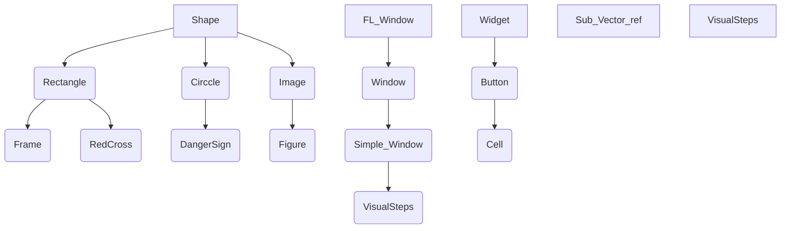

# Chess Project

## Работали над проектом:

- Рябчиков Михаил
- Бутчилкин Никита
- Курченко Матвей

## Недостатки проекта

* Фигуры иногда не отрисовываются на экране

* Нет предупреждения пользователя о том,что текстуры не могут быть загружены.

### Плюсы

* Понятный и удобный интерфей.

* Нет проблем с производительностью.

### Пожелания

* Сделать компеляцию через CMake проще для обычного пользователя(не все библиотеки находятся в репозитории)

## Диаграмма классов:

