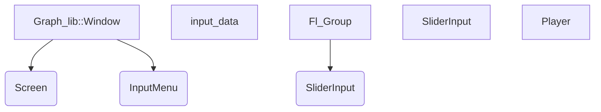

# Graph War

## Работали над проектом:

- Христолюбов Никита
- Юманов Василий
- Лопухов Егор
- Марков Александр
- Смирнов Константин

## Недостатки проекта

* Из-за ограничения чисел с плавающей точкой плохо рисуются функции с большой производной.

* Иногда "дыры" не отрисовываются

### Плюсы

* Понятный и удобный интерфейс

* Работает без ошибок

### Пожелания

* Завершить работу над онлайн режимом

* Добавить возможность компилировать проект под Linux

## Диаграмма классов:

